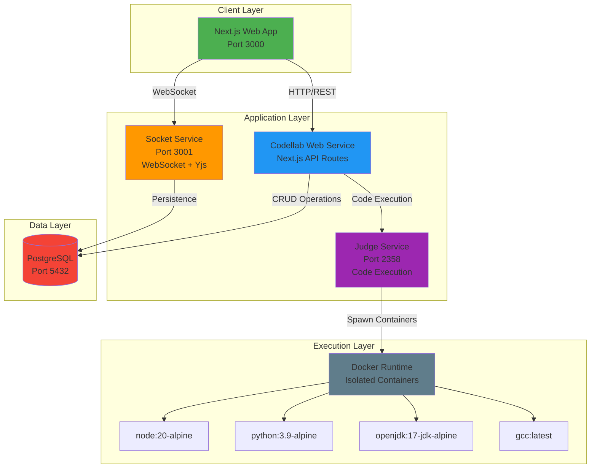
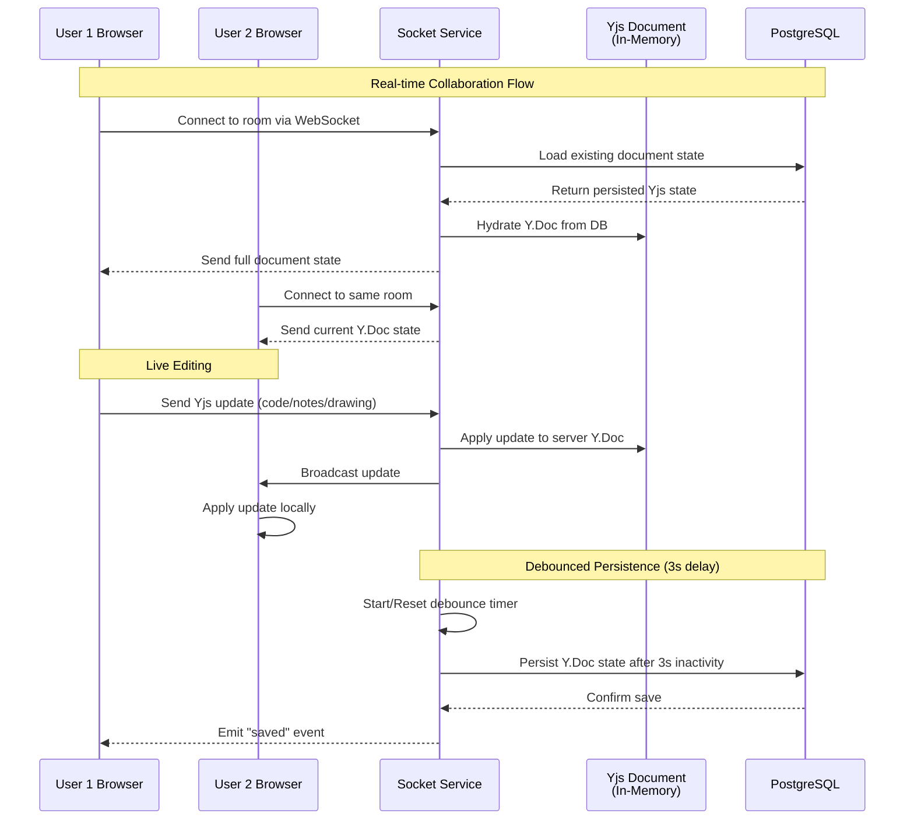
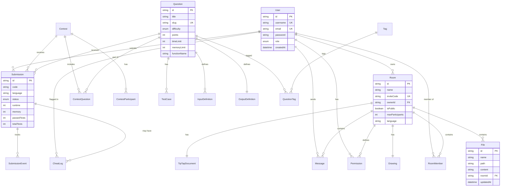
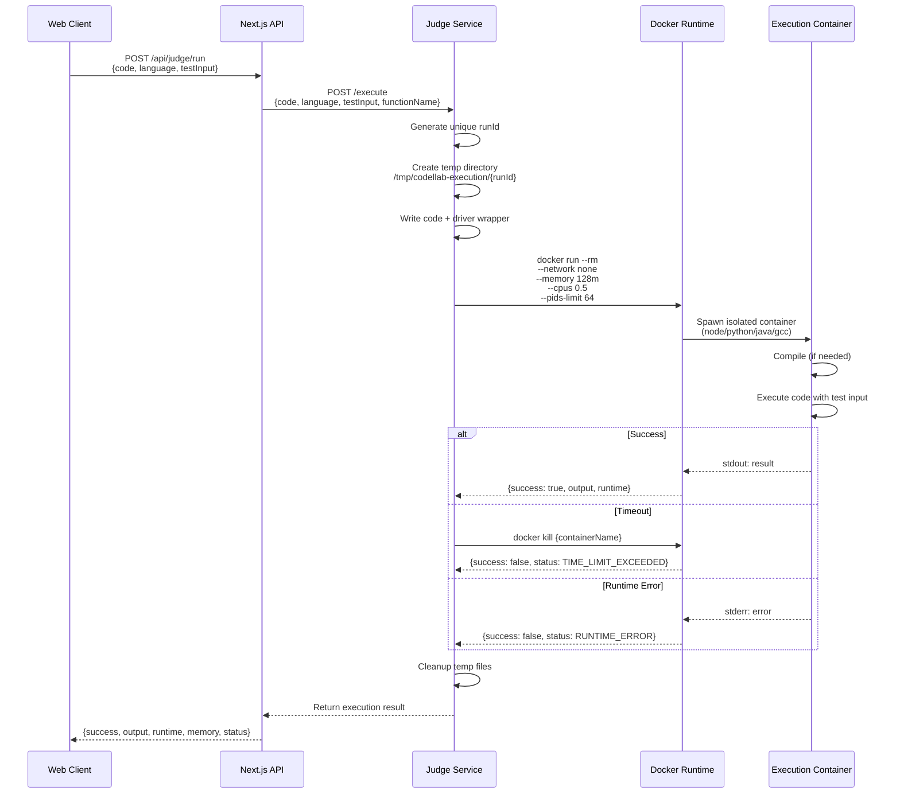
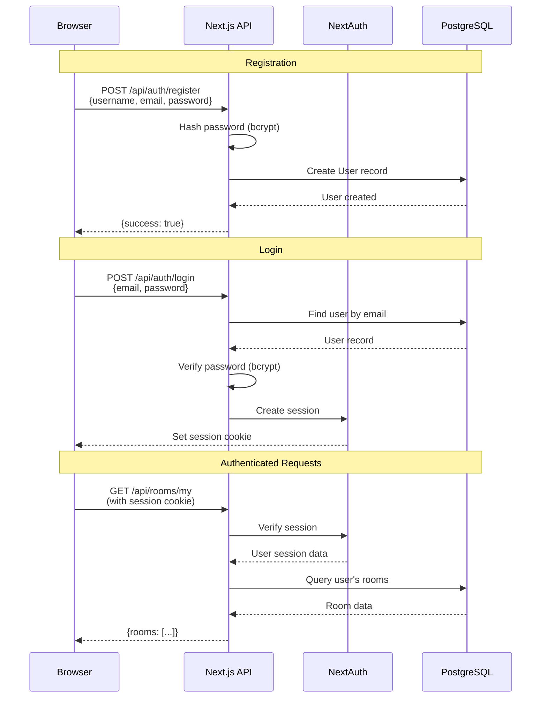
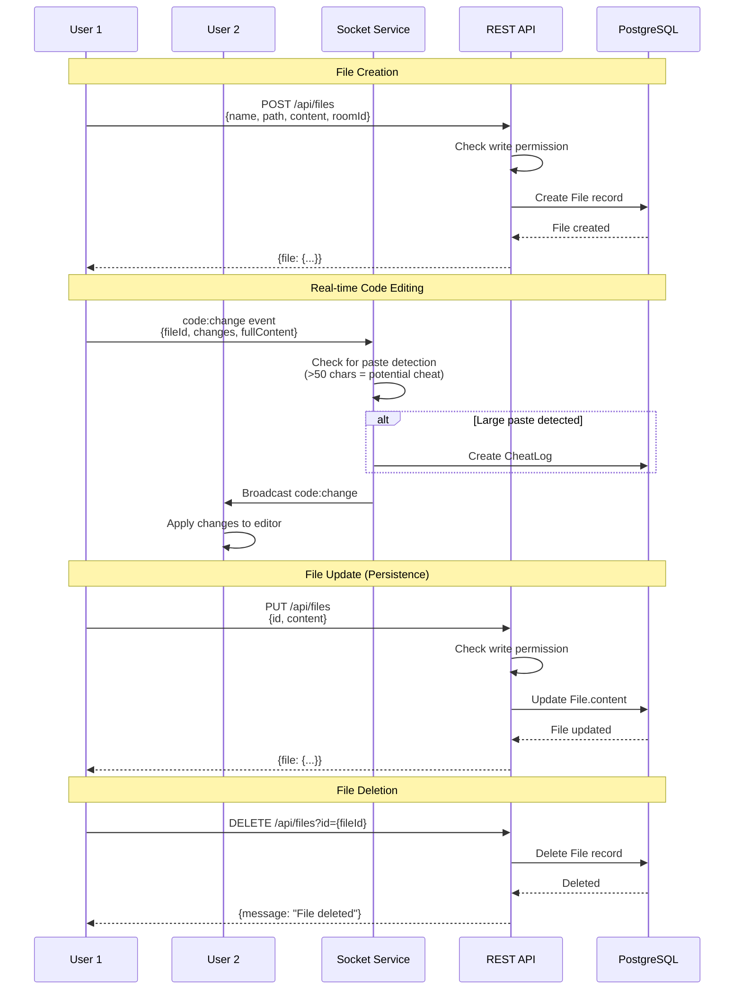

# Codellab - Collaborative Coding Platform

A real-time collaborative coding platform with integrated code execution, contests, and live collaboration features.

## 🏗️ System Architecture



## 🔄 Live Update & Synchronization Flow



## 📊 Database Schema



## 🚀 Code Execution Flow



## 🔐 Authentication Flow



## 📁 File Management & Synchronization



## 🛠️ Tech Stack

### Frontend
- **Next.js 16** - React framework with App Router
- **TypeScript** - Type-safe development
- **TailwindCSS** - Utility-first styling
- **Monaco Editor** - Code editor
- **TipTap** - Rich text editor for notes
- **Excalidraw** - Collaborative drawing
- **Dockview** - Panel management
- **Socket.IO Client** - Real-time communication
- **Yjs** - CRDT for collaboration

### Backend Services

#### Codellab Web Service
- **Next.js API Routes** - RESTful API
- **NextAuth** - Authentication
- **Prisma** - ORM for PostgreSQL
- **Zod** - Schema validation
- **bcrypt** - Password hashing

#### Socket Service
- **Socket.IO** - WebSocket server
- **Yjs** - Conflict-free replicated data types
- **Prisma** - Database access

#### Judge Service
- **Express** - HTTP server
- **Docker** - Containerized code execution
- **Supports**: JavaScript, Python, Java, C++

### Database
- **PostgreSQL 15** - Primary database

### DevOps
- **Docker & Docker Compose** - Containerization
- **pnpm** - Package management

## 📦 Services Overview

| Service | Port | Technology | Purpose |
|---------|------|------------|---------|
| **Web** | 3000 | Next.js | Main application & REST API |
| **Socket** | 3001 | Socket.IO + Yjs | Real-time collaboration |
| **Judge** | 2358 | Express + Docker | Code execution |
| **PostgreSQL** | 5432 | PostgreSQL 15 | Data persistence |

## 🚀 Getting Started

### Prerequisites
- Docker & Docker Compose
- Node.js 20+
- pnpm

### Installation

1. **Clone the repository**
```bash
git clone <repository-url>
cd Codellab
```

2. **Set up environment variables**
```bash
cp .env.example .env
# Edit .env with your configuration
```

3. **Start services with Docker Compose**
```bash
docker-compose up -d
```

4. **Run database migrations**
```bash
cd codellab
pnpm install
npx prisma migrate deploy
npx prisma db seed
```

5. **Access the application**
- Web App: http://localhost:3000
- Socket Service: http://localhost:3001
- Judge Service: http://localhost:2358

## 📚 API Documentation

Complete API documentation is available in [swagger.yaml](./swagger.yaml).

You can view it using:
- [Swagger Editor](https://editor.swagger.io/)
- [Swagger UI](https://swagger.io/tools/swagger-ui/)

### Quick API Reference

| Category | Endpoints |
|----------|-----------|
| **Auth** | `/api/auth/register`, `/api/auth/login`, `/api/auth/me` |
| **Rooms** | `/api/rooms`, `/api/rooms/{id}`, `/api/rooms/my`, `/api/rooms/{id}/join` |
| **Files** | `/api/files` (GET, POST, PUT, DELETE) |
| **Questions** | `/api/questions`, `/api/questions/{id}`, `/api/questions/{id}/testcases` |
| **Contests** | `/api/contests`, `/api/contests/{id}` |
| **Judge** | `/api/judge/run`, `/api/judge/submit` |
| **Submissions** | `/api/submissions` |
| **Admin** | `/api/admin/cheat-logs` |

## 🔌 WebSocket Events

### Client → Server

| Event | Payload | Description |
|-------|---------|-------------|
| `chat:message` | `{content, type, userId, roomId}` | Send chat message |
| `chat:typing` | `{isTyping: boolean}` | Typing indicator |
| `code:change` | `{fileId, changes, roomId}` | Code editor changes |
| `drawing:yjs-update` | `{roomId, update: Uint8Array}` | Drawing updates |
| `tiptap:update` | `{roomId, update: Uint8Array}` | Notes updates |
| `notes:yjs-update` | `{roomId, update: number[]}` | BlockNote updates |
| `user:role-change` | `{roomId, userId, newRole}` | Change user role (admin only) |

### Server → Client

| Event | Payload | Description |
|-------|---------|-------------|
| `room:users` | `Array<User>` | Updated participant list |
| `chat:history` | `Array<Message>` | Chat message history |
| `chat:message` | `Message` | New chat message |
| `chat:typing` | `{username}` | User started typing |
| `code:change` | `{fileId, changes}` | Code changes from other users |
| `drawing:yjs-update` | `Uint8Array` | Drawing updates |
| `tiptap:update` | `Uint8Array` | Notes updates |
| `user:role-changed` | `User` | User role updated |

## 🎯 Key Features

### Real-time Collaboration
- **Multi-user code editing** with cursor tracking
- **Collaborative notes** using TipTap + Yjs
- **Shared whiteboard** with Excalidraw
- **Live chat** with typing indicators and mentions
- **Permission system** (admin, writer, reader roles)

### Code Execution
- **Multi-language support**: JavaScript, Python, Java, C++
- **Isolated execution** in Docker containers
- **Resource limits**: 128MB memory, 0.5 CPU, 3s timeout
- **Test case validation** with custom inputs/outputs

### Contest System
- **Timed contests** with start/end times
- **Question management** with difficulty levels
- **Leaderboard** with scoring and rankings
- **Submission tracking** with runtime/memory metrics

### Security Features
- **Cheat detection** for paste events and suspicious behavior
- **Network isolation** for code execution containers
- **Permission-based access control**
- **Secure authentication** with bcrypt password hashing

## 📝 License

[Add your license here]

## 🤝 Contributing

[Add contribution guidelines here]
